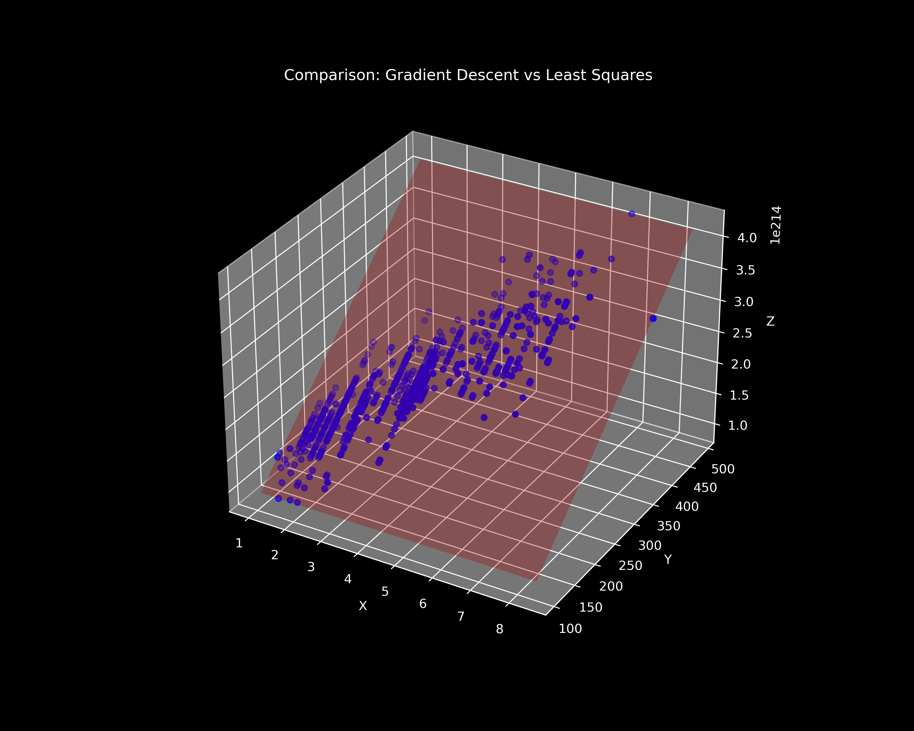

# 🚗 Gradient Descent vs. Least Squares: CO2 Emission Analysis

<p align="center">
  
  
  
</p>

This project performs a comparative analysis between **Gradient Descent** (iterative optimization) and **Least Squares** (closed-form analytical solution) applied to a real-world dataset. The task is to predict **$CO_2$ Emissions** based on vehicle **Engine Size**.

---

## 📊 Visual Comparison
The visualization below illustrates how both models fit the data points (Engine Size vs. $CO_2$ Emissions).


*Green Surface: Gradient Descent | Red Surface: Least Squares*

---

## 💡 Key Differences

| Feature | Gradient Descent | Least Squares (OLS) |
| :--- | :--- | :--- |
| **Approach** | Iterative (Approximation) | Analytical (Exact) |
| **Performance** | Scalable for large datasets | Computationally expensive for high $N$ |
| **Complexity** | Dependent on `Learning Rate` | Matrix inversion requirement |
| **Convergence** | Requires tuning | No tuning required |

---

## 📐 Mathematical Intuition

### 1. The Cost Function (MSE)
We aim to minimize the Mean Squared Error:
$$J(a, b, c) = \frac{1}{N} \sum_{i=1}^{N} (Z_{pred}^{(i)} - Z^{(i)})^2$$

### 2. Gradient Descent Updates
Parameters are updated iteratively using partial derivatives:
$$a_{new} = a_{old} - \alpha \cdot \frac{\partial J}{\partial a}$$
*where $\alpha$ is the learning rate.*

### 3. Least Squares (Closed Form)
We solve the normal equation directly:
$$\beta = (A^T A)^{-1} A^T Z$$

---

## 🚀 Getting Started

### Prerequisites
Ensure you have the required libraries installed:
```bash
pip install numpy matplotlib
